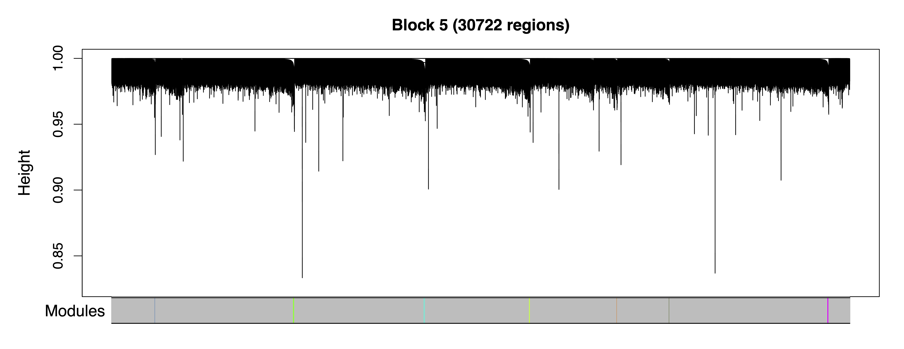

```{r setup, include = FALSE}
knitr::opts_chunk$set(
  collapse = TRUE,
  comment = "#>"
)
```

## Introduction
In this vignette, we use Comethyl to construct a weighted region comethylation network from WGBS data using clusters of CpGs grouped by genomic location. We identify modules of comethylated regions, investigate correlations with sample traits, and analyze functional enrichments. 

The data set includes 74 male cord blood samples from newborns who were later diagnosed with autism spectrum disorder (ASD) and those with typical development (TD). Comethylation modules were associated with 49 sample characteristics including diagnosis, cell types, sample sequencing information such as percent CpG methylation, and demographic data such as home ownership. The goal of this analysis is to explore interactions between the methylome and sample traits prior to diagnosis with ASD.

Raw data is available on GEO ([GSE140730](https://www.ncbi.nlm.nih.gov/geo/query/acc.cgi?acc=GSE140730)), see the [previous publication](https://genomemedicine.biomedcentral.com/articles/10.1186/s13073-020-00785-8) for more details.

## Setup

```
library(tidyverse)
library(comethyl)
```    

## Set Global Options
`WGCNA::disableWGCNAthreads()` prevents multi-threading for WGCNA calculations, including all functions using `WGCNA::cor()` and `WGCNA::bicor()`. This is recommended for large sets of regions (> 150,000). For smaller region sets, use `WGCNA::enableWGCNAthreads()` to allow for parallel calculations with the specified number of threads. If the number of threads is not provided, the default is the number of processors online. 

```
options(stringsAsFactors = FALSE)
Sys.setenv(R_THREADS = 1)
WGCNA::disableWGCNAThreads()
```

## Read Bismark CpG Reports
We read in an excel table with `openxlsx::read.xlsx()` where the first column includes the names of sample Bismark CpG reports and all other columns include trait values for each sample. All trait values must be numeric, though traits can be categorical or continuous. `getCpGs()` reads individual sample Bismark CpG reports into a single BSseq object and then saves it as a .rds file. See [Inputs](https://cemordaunt.github.io/comethyl/articles/comethyl.html#inputs) for more information.

```
colData <- openxlsx::read.xlsx("sample_info.xlsx", rowNames = TRUE)
bs <- getCpGs(colData, file = "Unfiltered_BSseq.rds")
```

## Examine CpG Totals at Different Cutoffs
`getCpGtotals()` calculates the total number and percent of CpGs remaining in a BSseq object after filtering at different `cov` (coverage) and `perSample` cutoffs and then saves it as a tab-separated text file. The purpose of this function is to help determine cutoffs to maximize the number of CpGs with sufficient data after filtering. Typically, the number of CpGs covered in 100% of samples decreases as the sample size increases, especially with low-coverage datasets. The goal for filtering is to try and balance the sequencing depth per CpG and the number of samples with the total number of CpGs.

`plotCpGtotals()` plots the number of CpGs remaining after filtering by different combinations of `cov` and `perSample` in a line plot and then saves it as a PDF. `plotCpGtotals()` is designed to be used in combination with `getCpGtotals()`. A ggplot is produced and can be further edited outside of this function if desired. 

```
CpGtotals <- getCpGtotals(bs, file = "CpG_Totals.txt")
plotCpGtotals(CpGtotals, file = "CpG_Totals.pdf")
```


## Filter BSobject
`filterCpGs()` subsets a BSseq object to include only those CpGs meeting `cov` and `perSample` cutoffs and then saves it as a .rds file. `filterCpGs()` is designed to be used after `cov` and `perSample` arguments have been optimized by `getCpGtotals()` and `plotCpGtotals()`. Here we keep only CpGs with at least 2 reads in at least 75% of samples.

```
bs <- filterCpGs(bs, cov = 2, perSample = 0.75, file = "Filtered_BSseq.rds")
```

## Call Regions
`getRegions()` generates a set of regions and some statistics based on the CpGs in a BSseq object. Regions can be defined based on CpG locations (as here for CpG clusters), built-in genomic annotations from `annotatr`, or a custom genomic annotation.

`plotRegionStats()` plots histograms of region statistics, while `plotSDstats()` plots methylation standard deviation versus region statistics. With these plots, we can get an idea of the characteristics of our regions and see how methylation variability is affected. The goal is to identify regions with biological variability rather than technical variability (due to low coverage).

```
regions <- getRegions(bs, file = "Unfiltered_Regions.txt")
plotRegionStats(regions, maxQuantile = 0.99, file = "Unfiltered_Region_Plots.pdf")
```


```
plotSDstats(regions, maxQuantile = 0.99, file = "Unfiltered_SD_Plots.pdf")
```


## Examine Region Totals at Different Cutoffs
`getRegionTotals()` calculates region totals at specified covMin and methSD cutoffs. Total regions (and thus total width and CpGs) are expected to decrease as the minimum coverage cutoff increases and SD cutoff increases. `plotRegionTotals()` plots these region totals by potential covMin and methSD cutoffs. 

```
regionTotals <- getRegionTotals(regions, file = "Region_Totals.txt")
plotRegionTotals(regionTotals, file = "Region_Totals.pdf")
```


## Filter Regions
`filterRegions()` subsets the regions to only include those meeting `covMin` and `methSD` cutoffs. `filterRegions()` is designed to be used after `covMin` and `methSD` functions have been optimized with `getRegionTotals()` and `plotRegionTotals()`. Here we filter for regions with at least 10 reads in all samples and with a methylation standard deviation of at least 5%. Then we examine our regions again with `plotRegionStats()` after filtering.

```
regions <- filterRegions(regions, covMin = 10, methSD = 0.05, file = "Filtered_Regions.txt")
plotRegionStats(regions, maxQuantile = 0.99, file = "Filtered_Region_Plots.pdf")
```


## Adjust Methylation Data for Principal Components
`getRegionMeth()` calculates region methylation from a BSseq object and saves it as a .rds. `model.matrix()` creates a design matrix for our set of samples. `adjustRegionMeth()` adjusts the region methylation for the top principal components and saves it as a .rds file. `getDendro()` clusters the samples based on the adjusted region methylation using Euclidean distance, while `plotDendro()` plots the dendrogram. We can use this dendrogram to see if there are any outlier samples or samples clustering separately due to batch effects.

```
meth <- getRegionMeth(regions, bs = bs, file = "Region_Methylation.rds")
mod <- model.matrix(~1, data = pData(bs))
methAdj <- adjustRegionMeth(meth, mod = mod, file = "Adjusted_Region_Methylation.rds")
getDendro(methAdj, distance = "euclidean") %>% 
plotDendro(file = "Sample_Dendrogram.pdf", expandY = c(0.25,0.08))
```


## Select Soft Power Threshold
`getSoftPower()` analyzes scale-free topology with Pearson or Bicor correlations to determine the best soft-thresholding power. This refers to the power to which all correlations are raised and how much more stronger correlations are weighted compared to weaker correlations. Pearson correlation is more sensitive than Bicor correlation, but is also more influenced by outlier samples. We use Pearson correlation in order to have higher power to detect correlated regions in a dataset with relatively low variability between samples.

`plotSoftPower()` plots the soft power threshold against scale free topology fit and connectivity. Typically, as the soft power threshold increases, fit increases and connectivity decreases. A soft power threshold should be selected as the lowest threshold where fit is 0.8 or higher (here we use 18). 

```
sft <- getSoftPower(methAdj, corType = "pearson", file = "Soft_Power.rds")
plotSoftPower(sft, file = "Soft_Power_Plots.pdf")
```


## Get Comethylation Modules
`getModules()` identifies comethylation modules using filtered regions, a chosen soft power threshold, and either Pearson or Bicor correlation. Here we use Pearson correlation for the greater sensitivity to detect modules. Regions are first formed into blocks close to but not exceeding the maximum block size. A full network analysis is then performed on each block to assign regions to modules; modules are merged if their eigennodes are highly correlated. The modules are then saved as a .rds file. This two-level clustering approach requires less computational memory and is significantly faster than performing network analysis on all regions at once. 

`plotRegionDendro()` plots region dendrograms and modules for each block. `getModuleBED()` creates a bed file of regions annotated with identified modules; regions in the unassigned grey module are excluded. 

```
modules <- getModules(methAdj, power = sft$powerEstimate, regions = regions, corType = "pearson", file = "Modules.rds")
plotRegionDendro(modules, file = "Region_Dendrograms.pdf")
BED <- getModuleBED(modules$regions, file = "Modules.bed")
```



## Examine Correlations between Modules and Samples
In order to examine relationships between modules, `getDendro(MEs)` clusters modules based on eigennode values using Bicor or Pearson correlations, which are then plotted with `plotDendro()`. `getCor(MEs)` calculates a correlation matrix for module eigennodes using Bicor or Pearson correlations, which are then plotted with `plotHeatmap()`. We use Bicor correlations at this stage to identify robust associations with less impact of outliers. Note that module correlation statistics (with p-values) can also be calculated with `getMEtraitCor()`. We can use these plots to identify large groups of modules with low correlation as well as highly correlated pairs (such as floral white and light cyan).

```
MEs <- modules$MEs
moduleDendro <- getDendro(MEs, distance = "bicor")
plotDendro(moduleDendro, labelSize = 4, nBreaks = 5, file = "Module_ME_Dendrogram.pdf")
```


```
moduleCor <- getCor(MEs, corType = "bicor")
plotHeatmap(moduleCor, rowDendro = moduleDendro, colDendro = moduleDendro, file = "Module_Correlation_Heatmap.pdf")
moduleCorStats <- getMEtraitCor(MEs, colData = MEs, corType = "bicor", robustY = TRUE, file = "Module_Correlation_Stats.txt")
```


To explore associations between samples, `getDendro(MEs, transpose = TRUE)` clusters the samples based on module eigennode values using Bicor or Pearson correlations, which are then plotted with `plotDendro()`. `getCor(MEs, transpose = TRUE)` calculates a correlation matrix for samples based on module eigennode vales using Bicor or Pearson correlations, which are then plotted with `plotHeatmap()`. `plotHeatmap()` can also be used to visualize module eigennode values for each sample as below. These plots can be useful to identify sets of samples with correlated methylation at these regions. This may also reveal the impact of batch effects on the identified modules.

```
sampleDendro <- getDendro(MEs, transpose = TRUE, distance = "bicor")
plotDendro(sampleDendro, labelSize = 3, nBreaks = 5, file = "Sample_ME_Dendrogram.pdf")
```


```
sampleCor <- getCor(MEs, transpose = TRUE, corType = "bicor")
plotHeatmap(sampleCor, rowDendro = sampleDendro, colDendro = sampleDendro, file = "Sample_Correlation_Heatmap.pdf")
```


```
plotHeatmap(MEs, rowDendro = sampleDendro, colDendro = moduleDendro, legend.title = "Module\nEigennode", legend.position = c(0.37,0.89), file = "Sample_ME_Heatmap.pdf")
```


## Test Correlations between Module Eigennodes and Sample Traits
Next we can look for modules associated with sample traits. `getMEtraitCor()` tests associations between module eigennodes and sample traits using Bicor or Pearson correlation. `getCor()` calculates a correlation matrix for sample traits using Bicor or Pearson correlations, which are clustered with `getDendro()`, and then plotted with `plotDendro()`. This allows us to identify correlated traits and order both traits and modules on the heatmap by similarity. `plotMEtraitCor()` creates a heatmap of sample traits versus modules. To focus on the top associations, another heatmap is created showing only the top 15 associations by p-value. Significant associations can be identified by a star or the p-value itself. Here we identify significant correlations between several modules and sample traits including cell type proportions, study cohort, genome-wide methylation, and later autism diagnosis.

```
MEtraitCor <- getMEtraitCor(MEs, colData = colData, corType = "bicor", file = "ME_Trait_Correlation_Stats.txt")
traitDendro <- getCor(MEs, y = colData, corType = "bicor", robustY = FALSE) %>% getDendro(transpose = TRUE)
plotDendro(traitDendro, labelSize = 3.5, expandY = c(0.65,0.08), file = "Trait_Dendrogram.pdf")
```


```
plotMEtraitCor(MEtraitCor, moduleOrder = moduleDendro$order, traitOrder = traitDendro$order, file = "ME_Trait_Correlation_Heatmap.pdf")
```


```
plotMEtraitCor(MEtraitCor, moduleOrder = moduleDendro$order, traitOrder = traitDendro$order, topOnly = TRUE, label.type = "p", label.size = 4, label.nudge_y = 0, legend.position = c(1.11, 0.795), colColorMargins = c(-1,4.75,0.5,10.1), file = "Top_ME_Trait_Correlation_Heatmap.pdf", width = 8.5, height = 4.25)
```


## Explore Significant Module Eigennode - Trait Correlations
### Plot Module Eigennodes vs Traits
To further investigate top module-trait associations, `plotMEtraitDot()` creates a dotplot of a module eigennode by a categorical trait, while `plotMEtraitScatter()` creates a scatterplot of a module eigennode by a continuous trait. Any module and any sample trait can be selected. These plots can help verify that the module-trait association is robust and identify any outlier samples. Here we see that the bisque 4 module has lower methylation in ASD samples, while the pale turquoise module methylation correlates (in opposite directions) with the proportion of granulocytes and B cells.

```
plotMEtraitDot(MEs$bisque4, trait = colData$Diagnosis_ASD, traitCode = c("TD" = 0, "ASD" = 1), colors = c("TD" = "#3366CC", "ASD" = "#FF3366"), ylim = c(-0.2,0.2), xlab = "Diagnosis", ylab = "Bisque 4 Module Eigennode", file = "bisque4_ME_Diagnosis_Dotplot.pdf")
```


```
plotMEtraitScatter(MEs$paleturquoise, trait = colData$Gran, ylim = c(-0.15,0.15), xlab = "Granulocytes", ylab = "Pale Turquoise Module Eigennode", file = "paleturquoise_ME_Granulocytes_Scatterplot.pdf")
```


```
plotMEtraitScatter(MEs$paleturquoise, trait = colData$Bcell, ylim = c(-0.15,0.15), xlab = "B-cells", ylab = "Pale Turquoise Module Eigennode", file = "paleturquoise_ME_Bcells_Scatterplot.pdf")
```


### Plot Region Methylation vs Traits
Next we dig further into the data and plot the raw methylation values against a sample trait using `plotMethTrait()`. These values are not adjusted by principal components, just centered on the mean methylation for each region. This allows you to see the change in actual methylation across regions in a module in relation to a trait. We plot the same associations as above. 

```
regions <- modules$regions
plotMethTrait("bisque4", regions = regions, meth = meth, trait = colData$Diagnosis_ASD, traitCode = c("TD" = 0, "ASD" = 1), traitColors = c("TD" = "#3366CC", "ASD" = "#FF3366"), trait.legend.title = "Diagnosis", file = "bisque4_Module_Methylation_Diagnosis_Heatmap.pdf")
```              


```
plotMethTrait("paleturquoise", regions = regions, meth = meth, trait = colData$Gran, expandY = 0.04, trait.legend.title = "Granulocytes", trait.legend.position = c(1.034,3.35), file = "paleturquoise_Module_Methylation_Granulocytes_Heatmap.pdf")
```              


```
plotMethTrait("paleturquoise", regions = regions, meth = meth, trait = colData$Bcell, expandY = 0.04, trait.legend.title = "B-cells", trait.legend.position = c(1.004,3.35), file = "paleturquoise_Module_Methylation_Bcells_Heatmap.pdf")
```              


## Annotate Modules
`annotateModule()` annotates a module of choice with nearby gene and CpG island context. Genes are added to regions using GREAT, gene info is added from BioMart, and both gene and CpG island context is added from `annotatr`. `getGeneList()` then extracts just the genes for that module, in the form of the gene symbol, description, Ensembl ID, or NCBI Entrez ID.

```
regionsAnno <- annotateModule(regions, module = c("bisque4", "paleturquoise"), genome = "hg38", file = "Annotated_bisque4_paleturquoise_Module_Regions.txt")
geneList_bisque4 <- getGeneList(regionsAnno, module = "bisque4")
geneList_paleturquoise <- getGeneList(regionsAnno, module = "paleturquoise")
```

## Analyze Functional Enrichment
Next we test our modules of interest for enrichment in genes with particular functions. `listOntologies()` gets available ontologies for GREAT with the selected genome assembly. `enrichModule()` analyzes functional enrichments for all regions assigned to the selected module, relative to the background set of all regions input into the network (including those assigned to the grey (unassigned) module). `plotEnrichment()` then plots the module enrichments from GREAT.

Using this approach, we see that the bisque 4 module associated with ASD diagnosis is enriched for genes that play a role in glial differentiation and other neurodevelopmental processes. In contrast the pale turquoise module associated with the proportion of immune cell types is enriched for genes that function in the response to bacterial infection and other immune processes.

```
ontologies <- listOntologies("hg38", version = "4.0.4")
enrich_bisque4 <- enrichModule(regions, module = "bisque4", genome = "hg38", file = "bisque4_Module_Enrichment.txt")
plotEnrichment(enrich_bisque4, file = "bisque4_Module_Enrichment_Plot.pdf")
```


```
enrich_paleturquoise <- enrichModule(regions, module = "paleturquoise", genome = "hg38", file = "paleturquoise_Module_Enrichment.txt")
plotEnrichment(enrich_paleturquoise, axis.text.y.size = 14, width = 10, file = "paleturquoise_Module_Enrichment_Plot.pdf")
```


