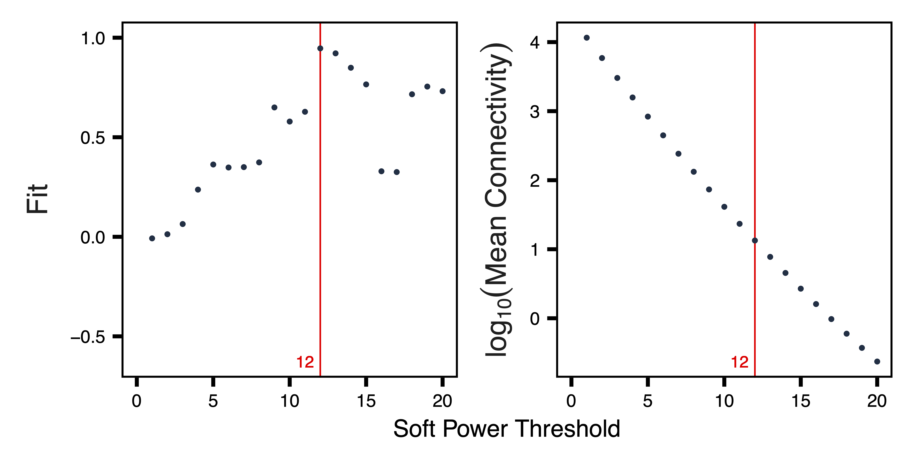

```{r setup, include = FALSE}
knitr::opts_chunk$set(
  collapse = TRUE,
  comment = "#>"
)
```

# Introduction

Comethyl is a systems biology method for multivariate analysis of whole genome bisulfite sequencing (WGBS) data. Comethyl can be used to construct a weighted region comethylation network from user-defined regions, identify comethylation modules and the genomic regions that make up those modules, analyze functional enrichments, and investigate correlations between comethylation modules and sample traits of interest.

# Glossary of Concepts

| Term | Definition |
|:-----|:-----------|
| Comethylation network | A weighted network in which nodes correspond to genomic regions and edges correspond to correlations between region DNA methylation. |
| Module | A group of genomic regions with correlated DNA methylation. |
| Module Eigennode | The first principal component of a module, can be thought of as a weighted average of methylation values. |
| Connectivity | The sum of the correlations between a region and all other regions in the comethylation network. |
| Fit | The R-squared value assessing how well the network meets the criteria for scale-free topology. |
| Soft Power Threshold | The power to which all correlations are raised when constructing the weighted network. |
| Hub Region | The region in a module whose methylation is most highly correlated with the module eigennode. |

# Inputs

**Bismark Cytosine Reports:** Following WGBS of your samples, the raw fastq files should be processed into CpG count matrices where biases have been removed. One available pipeline is [CpG_Me](https://github.com/ben-laufer/CpG_Me), which performs read alignment and quality control of WGBS raw fastq files, and then generates the Bismark Cytosine Reports used by Comethyl.

**Sample Trait Table** (```"sample_info.xlsx"```)**:** This is a data frame with samples (specifying CpG reports) as rows and sample traits of interest as columns. All values in the table must be numeric, though the data can be either categorical or continuous for any given trait. Sample traits can include all available information about potential variables of interest as well as potential confounding variables. In WGBS datasets, potential confounding variables include cell type proportions as well as technical variables including coverage, read duplication, read trimming, and global cytosine methylation levels. For human populations, metadata should include clinical, diagnostic, and demographic data, as well as sample collection characteristics, such as gestational age and birthweight for cord blood. For experimental studies in animal models or cell cultures, experimental variables should be included in the metadata for exploring module-trait relationships. The comethylation modules identified from the Bismark Cytosine Reports will be correlated with the traits in this table. Keep in mind that tests for multiple hypotheses (i.e. FDR correction) will depend on the number of traits you include in your Sample Trait Table. 

# Annotation

One unique feature of Comethyl is the ability to define regions based on functional annotations, such as CpG islands, gene bodies, enhancers, or a custom annotation. Since gene body methylation can correlate positively with expression, gene bodies were selected as alternative regions to explore in the cord blood data set, in addition to the approach of calling genomic regions by CpG location. This vignette shows the results from the gene body analysis. 

# Usage

The following example is from a dataset of 74 male cord blood samples from newborns who were later diagnosed with autism spectrum disorder (ASD) and those with typical development (TD). Comethylation modules were associated with 49 sample characteristics including diagnosis, cell types, sample sequencing information such as percent CpG methylation, and demographic data such as home ownership. Raw data is available on GEO ([GSE140730](https://www.ncbi.nlm.nih.gov/geo/query/acc.cgi?acc=GSE140730)), see the [previous publication](https://genomemedicine.biomedcentral.com/articles/10.1186/s13073-020-00785-8) for more details.

## Setup

```
library(comethyl)
```    

## Set Global Options
`enableWGCNAthreads(nThreads = NULL)` allows multi-threading for calculations using `cor` or `bicor` functions. If the number of threads is not provided, the default number used is the number of processors online. 

```
options(stringsAsFactors = FALSE)
Sys.setenv(R_THREADS = 1)
enableWGCNAThreads(nThreads = 4)
```

## Read Bismark CpG Reports
`getCpGs()` reads individual sample Bismark CpG reports into a single BSseq object and then saves it as a .rds file. `colData` calls a data frame whose rows specify CpG reports to load into the BSseq object and whose columns are sample traits with numeric values (categorical or continuous). 

```
colData <- read.xlsx("sample_info.xlsx", rowNames = TRUE)
bs <- getCpGs(colData, file = "Unfiltered_BSseq.rds")
```

## Examine CpG Totals at Different Cutoffs
`getCpGtotals()` calculates the total number and percent of CpGs remaining in a BSseq object after filtering at different `cov` (coverage) and `perSample` cutoffs and then saves it as a tab-separated text file. The purpose of this function is to help determine cutoffs to maximize the number of CpGs with sufficient data after filtering. Typically, the number of CpGs covered in 100% of samples decreases as the sample size increases, especially with low-coverage datasets. `plotCpGtotals()` plots the number of CpGs remaining after filtering by different combinations of `cov` and `perSample` in a line plot and then saves it as a PDF. `plotCpGtotals()` is designed to be used in combination with `getCpGtotals()`. A ggplot is produced and can be further edited outside of this function if desired. 

```
CpGtotals <- getCpGtotals(bs, file = "CpG_Totals.txt")
plotCpGtotals(CpGtotals, file = "CpG_Totals.pdf")
```


## Filter BSobject
`filterCpGs()` subsets a BSseq object to include only those CpGs meeting `cov` and `perSample` cutoffs and then saves it as a .rds file. `filterCpGs()` is designed to be used after `cov` and `perSample` arguments have been optimized by `getCpGtotals()` and `plotCpGtotals()`. 

```
bs <- filterCpGs(bs, cov = 2, perSample = 0.75, file = "Filtered_BSseq.rds")
```

## Call Regions
`getRegions()` calculates region statistics from the filtered BSobject and saves it as a tab-separated text file. `getRegions()` allows for selection of annotation and genome. `plotRegionStats()` plots histograms of region statistics and saves the plots as a PDF. `plotSDstats()` plots methylation standard deviation versus region statistics and saves the plots as a PDF. 

```
regions <- getRegions(bs, file = "Unfiltered_Regions.txt")
plotRegionStats(regions, maxQuantile = 0.99, file = "Unfiltered_Region_Plots.pdf")
```


```
plotSDstats(regions, maxQuantile = 0.99, file = "Unfiltered_SD_Plots.pdf")
```


## Examine Region Totals at Different Cutoffs
`getRegionTotals()` calculates region totals at specified covMin and methSD cutoffs and saves as a tab-separated text file. Total CpGs are expected to decrease as the minimum coverage cutoff increases and SD cutoff increases. `plotRegionTotals()` plots region totals and saves it as a PDF. 

```
regionTotals <- getRegionTotals(regions, file = "Region_Totals.txt")
plotRegionTotals(regionTotals, file = "Region_Totals.pdf")
```


## Filter Regions
`filterRegions()` subsets the unfiltered regions to only include those meeting `covMin` and `methSD` cutoffs and then saves it as a tab-separated text file. `filterRegions()` is designed to be used after `covMin` and `methSD` functions have been optimized with `getRegionTotals()` and `plotRegionTotals()`. `plotRegionStats()` plots total regions, total width, and total CpGs against SD cutoff, accounting for different minimum coverage cutoffs and saves the plots as a PDF. 

```
regions <- filterRegions(regions, covMin = 10, methSD = 0.05, file = "Filtered_Regions.txt")
plotRegionStats(regions, maxQuantile = 0.99, file = "Filtered_Region_Plots.pdf")
```


## Adjust Methylation Data for Principal Components
`getRegionMeth()` calculates region methylation from a BSseq object and saves it as a .rds. `model.matrix()` creates a design matrix of the region methylation. `adjustRegionMeth()` adjusts the region methylation for the top principal components and saves it as a .rds file. `getDendro()` clusters the samples based on the adjusted region methylation using Euclidean, Pearson, or Bicor distances. `plotDendro()` creates a dendrogram of samples from the `getDendro()` function and saves it as a PDF. 

```
meth <- getRegionMeth(regions, bs = bs, file = "Region_Methylation.rds")
mod <- model.matrix(~1, data = pData(bs))
methAdj <- adjustRegionMeth(meth, mod = mod, file = "Adjusted_Region_Methylation.rds")
getDendro(methAdj, distance = "euclidean") %>% plotDendro(file = "Sample_Dendrogram.pdf", expandY = c(0.25,0.08))
```


## Select Soft Power Threshold
`getSoftPower()` analyzes scale-free topology with either Pearson or Bicor correlations to determine the best soft-thresholding power. This refers to the power to which all correlations are raised. Pearson correlation is mean-based, assumes that the methylation data follows a normal distribution, and is sensitive to outliers. Bicor correlation is median-based and thus less sensitive to outliers, and is more robust than Pearson. `plotSoftPower()` plots the soft power threshold against scale free topology fit and against connectivity. Typically, as the soft power threshold increases, fit increases and connectivity decreases. A soft power threshold should be selected where fit is 0.8 or higher. 

```
sft <- getSoftPower(methAdj, corType = "pearson", file = "Soft_Power.rds")
plotSoftPower(sft, file = "Soft_Power_Plots.pdf")
```



## Get Comethylation Modules
`getModules()` identifies comethylation modules using filtered regions, a chosen soft power threshold, and either Pearson or Bicor correlation. Regions are first formed into blocks close to but not exceeding the maximum block size. A full network analysis is then performed on each block to assign them to modules; modules are merged if their eigennodes are highly correlated. The modules are then saved as a .rds file. This two-level clustering approach requires less computational memory and is significantly faster than performing full network analysis on every region. `plotRegionDendro()` plots region dendrograms and modules for each block and saves as a PDF. `getModuleBED()` creates a bed file of regions annotated with identified modules; regions in the unassigned grey module are excluded. 

```
modules <- getModules(methAdj, power = sft$powerEstimate, regions = regions, corType = "pearson", file = "Modules.rds")
plotRegionDendro(modules, file = "Region_Dendrograms.pdf")
BED <- getModuleBED(modules$regions, file = "Modules.bed")
```


## Examine Correlations between Modules and Samples
`getDendro(MEs)` clusters modules based on eigennode values using Bicor or Pearson correlations, which are then plotted with `plotDendro()` and saved as a PDF. `getCor(MEs)` calculates a correlation matrix for module eigennodes using Bicor or Pearson correlations, which are then plotted with `plotHeatmap()` and saved as a PDF. Module correlation statistics can also be calculated with `getMEtraitCor()`.

```
MEs <- modules$MEs
moduleDendro <- getDendro(MEs, distance = "bicor")
plotDendro(moduleDendro, labelSize = 4, nBreaks = 5, file = "Module_ME_Dendrogram.pdf")
```


```
moduleCor <- getCor(MEs, corType = "bicor")
plotHeatmap(moduleCor, rowDendro = moduleDendro, colDendro = moduleDendro, file = "Module_Correlation_Heatmap.pdf")
moduleCorStats <- getMEtraitCor(MEs, colData = MEs, corType = "bicor", robustY = TRUE, file = "Module_Correlation_Stats.txt")
```


`getDendro(MEs, transpose = TRUE)` clusters the samples based on module eigennode values using Bicor or Pearson correlations, which are then plotted with `plotDendro()` and saved as a PDF. `getCor(MEs, transpose = TRUE)` calculates a correlation matrix for samples based on module eigennode vales using Bicor or Pearson correlations, which are then plotted with `plotHeatmap()` and saved as a PDF.

```
sampleDendro <- getDendro(MEs, transpose = TRUE, distance = "bicor")
plotDendro(sampleDendro, labelSize = 3, nBreaks = 5, file = "Sample_ME_Dendrogram.pdf")
```


```
sampleCor <- getCor(MEs, transpose = TRUE, corType = "bicor")
plotHeatmap(sampleCor, rowDendro = sampleDendro, colDendro = sampleDendro, file = "Sample_Correlation_Heatmap.pdf")
```


`plotHeatmap` plots samples against module eigennodes and saves as a PDF.

```
plotHeatmap(MEs, rowDendro = sampleDendro, colDendro = moduleDendro, legend.title = "Module\nEigennode", legend.position = c(0.37,0.89), file = "Sample_ME_Heatmap.pdf")
```


## Test Correlations between Module Eigennodes and Sample Traits
`getMEtraitCor()` tests associations between module eigennodes and sample traits using Bicor or Pearson correlation and the results are saved as a tab-separated text file. `getCor()` calculates a correlation matrix for sample traits using Bicor or Pearson correlations, which are clustered with `getDendro()`, and then plotted with `plotDendro()` and saved as a PDF. `plotMEtraitCor()` creates a heatmap of sample traits versus modules, which is saved as a PDF. Traits are ordered on the heatmap by similarity. Another heatmap is created and saved as a PDF by `plotMEtraitCor()` to show only module eigennode-sample trait correlations that are significant at a specified p-value. 

```
MEtraitCor <- getMEtraitCor(MEs, colData = colData, corType = "bicor", file = "ME_Trait_Correlation_Stats.txt")
traitDendro <- getCor(MEs, y = colData, corType = "bicor", robustY = FALSE) %>% getDendro(transpose = TRUE)
plotDendro(traitDendro, labelSize = 3.5, expandY = c(0.65,0.08), file = "Trait_Dendrogram.pdf")
```


```
plotMEtraitCor(MEtraitCor, moduleOrder = moduleDendro$order, traitOrder = traitDendro$order, file = "ME_Trait_Correlation_Heatmap.pdf")
```


```
plotMEtraitCor(MEtraitCor, moduleOrder = moduleDendro$order, traitOrder = traitDendro$order, topOnly = TRUE, label.type = "p", label.size = 4, label.nudge_y = 0, legend.position = c(1.14, 0.745), colColorMargins = c(-1,5.1,0.5,10.47), file = "Top_ME_Trait_Correlation_Heatmap.pdf", width = 7, height = 3.5)
```


## Explore Significant Module Eigennode - Trait Correlations
### Plot Module Eigennodes vs Traits
`plotMEtraitDot()` creates a dotplot of a module eigennode by a categorical trait and saves it as a PDF; any module and any sample trait can be selected. `plotMEtraitScatter()` creates a scatterplot of a module eigennode by a continuous trait and saves it as a PDF; any module and any sample trait can be selected.

```
plotMEtraitDot(MEs$bisque4, trait = colData$Diagnosis_ASD, traitCode = c("TD" = 0, "ASD" = 1), colors = c("TD" = "#3366CC", "ASD" = "#FF3366"), ylim = c(-0.2,0.2), xlab = "Diagnosis", ylab = "Bisque 4 Module Eigennode", file = "bisque4_ME_Diagnosis_Dotplot.pdf")
```


```
plotMEtraitScatter(MEs$greenyellow, trait = colData$Gran, ylim = c(-0.15,0.15), xlab = "Granulocytes", ylab = "Green Yellow Module Eigennode", file = "greenyellow_ME_Granulocytes_Scatterplot.pdf")
```


```
plotMEtraitScatter(MEs$greenyellow, trait = colData$home_ownership, ylim = c(-0.15,0.15), xlab = "Home Ownership", ylab = "Green Yellow Module Eigennode", file = "greenyellow_ME_Home_Ownership_Scatterplot.pdf")
```

### Plot Region Methylation vs Traits
`plotMethTrait()` plots relative methylation by a sample trait and saves the heatmap as a PDF. 

```
regions <- modules$regions
plotMethTrait("greenyellow", regions = regions, meth = meth, trait = colData$Gran, expandY = 0.04, trait.legend.title = "Granulocytes", trait.legend.position = c(1.034,3.35), file = "greenyellow_Module_Methylation_Granulocytes_Heatmap.pdf")
```  


## Annotate Modules
`annotateModule()` annotates a module of choice with nearby gene and CpG island context. Genes are added to regions using GREAT, gene info is added from BioMart, and both gene and CpG island context is added from annotatr. The file is saved as a tab-separated text file. 

```
regionsAnno <- annotateModule(regions, module = c("greenyellow"), genome = "hg38", file = "Annotated_greenyellow_Module_Regions.txt")
geneList_greenyellow <- getGeneList(regionsAnno, module = "greenyellow")
```

## Analyze Functional Enrichment
`listOntologies()` gets available ontologies for GREAT with the selected genome assembly. `enrichModule()` analyzes functional enrichments for all regions assigned to the selected module and saves the result as a tab-separated text file. `plotEnrichment()` plots the module enrichments from GREAT. 

```
ontologies <- listOntologies("hg38", version = "4.0.4")
enrich_bisque4 <- enrichModule(regions, module = "greenyellow", genome = "hg38", file = "greenyellow_Module_Enrichment.txt")
plotEnrichment(enrich_greenyellow, file = "greenyellow_Module_Enrichment_Plot.pdf")
```


