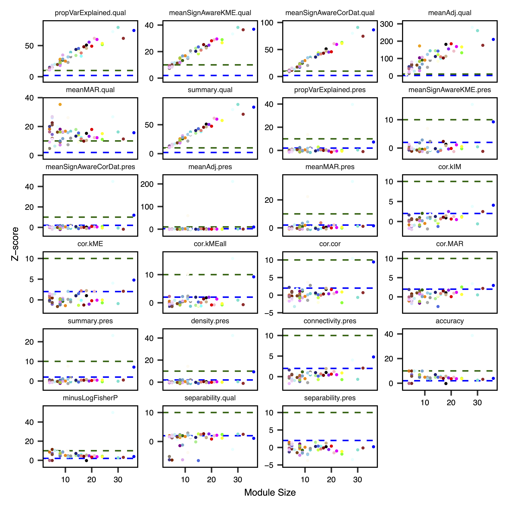

```{r setup, include = FALSE}
knitr::opts_chunk$set(
  collapse = TRUE,
  comment = "#>"
)
```

## Introduction
In this vignette, we use Comethyl to construct a comethylation network using clusters of CpGs grouped by genomic location in a replication dataset, and then compare the preservation of modules from the original dataset. We identify modules of comethylated regions, generate statistics of module preservation, and visualize them. 

The original dataset explored in the [CpG Cluster Analysis](https://cemordaunt.github.io/comethyl/articles/CpG_Cluster_Analysis.html) vignette included 74 male cord blood samples from newborns who were later diagnosed with autism spectrum disorder (ASD) and those with typical development (TD). The replication dataset has the same design and includes 38 samples. The goal of this analysis is to evaluate the consistency of our identified modules in an independent group of individuals.

Raw data is available on GEO ([GSE140730](https://www.ncbi.nlm.nih.gov/geo/query/acc.cgi?acc=GSE140730)), see the [previous publication](https://genomemedicine.biomedcentral.com/articles/10.1186/s13073-020-00785-8) for more details.

## Setup

```
library(tidyverse)
library(comethyl)
```    

## Set Global Options
`disableWGCNAthreads()` prevents multi-threading for WGCNA calculations, including all functions using `cor()` and `bicor()`. This is recommended for large sets of regions (> 150,000). For smaller region sets, use `enableWGCNAthreads()` to allow for parallel calculations with the specified number of threads. If the number of threads is not provided, the default is the number of processors online. 

```
options(stringsAsFactors = FALSE)
Sys.setenv(R_THREADS = 1)
disableWGCNAThreads()
```

## Read Bismark CpG Reports
We read in an excel table with `openxlsx::read.xlsx()` where the first column includes the names of sample Bismark CpG reports and all other columns include trait values for each sample. All trait values must be numeric, though traits can be categorical or continuous. `getCpGs()` reads individual sample Bismark CpG reports into a single BSseq object and then saves it as a .rds file. See [Inputs](https://cemordaunt.github.io/comethyl/articles/comethyl.html#inputs) for more information.

`filterCpGs()` subsets a BSseq object to include only those CpGs meeting `cov` and `perSample` cutoffs and then saves it as a .rds file. `filterCpGs()` is designed to be used after `cov` and `perSample` arguments have been optimized by `getCpGtotals()` and `plotCpGtotals()`. Here we keep only CpGs with at least 2 reads in at least 75% of samples.

```
colData_rep <- openxlsx::read.xlsx("replication_sample_info.xlsx", rowNames = TRUE)
bs_rep <- getCpGs(colData_rep, file = "Replication_Unfiltered_BSseq.rds")
bs_disc <- readRDS("Discovery_Filtered_BSseq.rds")
bs_rep <- IRanges::subsetByOverlaps(bs_rep, ranges = bs_disc)
bs_rep <- filterCpGs(bs_rep, cov = 1, perSample = 0.01, file = "Replication_Filtered_BSseq.rds")
```

## Call Regions
`getRegions()` generates a set of regions and some statistics based on the CpGs in a BSseq object. Regions can be defined based on CpG locations (as here for CpG clusters), built-in genomic annotations from `annotatr`, or a custom genomic annotation.

`plotRegionStats()` plots histograms of region statistics, while `plotSDstats()` plots methylation standard deviation versus region statistics. With these plots, we can get an idea of the characteristics of our regions and see how methylation variability is affected. The goal is to identify regions with biological variability rather than technical variability (due to low coverage).

```
regions_disc <- read.delim("Discovery_Filtered_Regions.txt") %>%
        select(chr, start, end, RegionID)
regions_disc <- with(regions_disc, GenomicRanges::GRanges(seqnames = chr, ranges = IRanges::IRanges(start = start, end = end), name = RegionID))
regions_rep <- getRegions(bs_rep, custom = regions_disc, n = 1, save = FALSE) %>%
select(RegionID = name, chr:methSD)
write_tsv(regions_rep, file = "Replication_Unfiltered_Regions.txt")
plotRegionStats(regions_rep, maxQuantile = 0.99, file = "Replication_Unfiltered_Region_Plots.pdf")
```


```
plotSDstats(regions_rep, maxQuantile = 0.99, file = "Replication_Unfiltered_SD_Plots.pdf")
```


## Examine Region Totals at Different Cutoffs
`getRegionTotals()` calculates region totals at specified covMin and methSD cutoffs. Total regions (and thus total width and CpGs) are expected to decrease as the minimum coverage cutoff increases and SD cutoff increases. `plotRegionTotals()` plots these region totals by potential covMin and methSD cutoffs. 

```
regionTotals_rep <- getRegionTotals(regions_rep, file = "Replication_Region_Totals.txt")
plotRegionTotals(regionTotals_rep, file = "Replication_Region_Totals.pdf")
```


## Filter Regions
`filterRegions()` subsets the regions to only include those meeting `covMin` and `methSD` cutoffs. `filterRegions()` is designed to be used after `covMin` and `methSD` functions have been optimized with `getRegionTotals()` and `plotRegionTotals()`. Here we filter for regions with at least 10 reads in all samples and with a methylation standard deviation of at least 5%. Then we examine our regions again with `plotRegionStats()` after filtering.

```
regions <- filterRegions(regions_rep, covMin = 5, methSD = 0.05, file = "Replication_Filtered_Regions.txt")
plotRegionStats(regions_rep, maxQuantile = 0.99, file = "Replication_Filtered_Region_Plots.pdf")
```


## Adjust Methylation Data for Principal Components
`getRegionMeth()` calculates region methylation from a BSseq object and saves it as a .rds. `model.matrix()` creates a design matrix for our set of samples. `adjustRegionMeth()` adjusts the region methylation for the top principal components and saves it as a .rds file. `getDendro()` clusters the samples based on the adjusted region methylation using Euclidean distance, while `plotDendro()` plots the dendrogram. We can use this dendrogram to see if there are any outlier samples or samples clustering separately due to batch effects.

```
meth_rep <- getRegionMeth(regions_rep, bs = bs_rep, file = "Replication_Region_Methylation.rds")
mod_rep <- model.matrix(~1, data = bsseq::pData(bs_rep))
methAdj_rep <- adjustRegionMeth(meth_rep, mod = mod_rep, file = "Replication_Adjusted_Region_Methylation.rds")
getDendro(methAdj_rep, distance = "euclidean") %>%
plotDendro(file = "Replication_Sample_Dendrogram.pdf", expandY = c(0.25, 0.08))
```


## Select Soft Power Threshold
`getSoftPower()` analyzes scale-free topology with Pearson or Bicor correlations to determine the best soft-thresholding power. This refers to the power to which all correlations are raised and how much more stronger correlations are weighted compared to weaker correlations. Pearson correlation is more sensitive than Bicor correlation, but is also more influenced by outlier samples. We use Pearson correlation in order to have higher power to detect correlated regions in a dataset with relatively low variability between samples.

`plotSoftPower()` plots the soft power threshold against scale free topology fit and connectivity. Typically, as the soft power threshold increases, fit increases and connectivity decreases. A soft power threshold should be selected as the lowest threshold where fit is 0.8 or higher (here we use 18). 

```
sft_rep <- getSoftPower(methAdj_rep, powerVector = 1:30, corType = "pearson", file = "Replication_Soft_Power.rds")
plotSoftPower(sft_rep, file = "Replication_Soft_Power_Plots.pdf")
```


## Get Comethylation Modules
`getModules()` identifies comethylation modules using filtered regions, a chosen soft power threshold, and either Pearson or Bicor correlation. Here we use Pearson correlation for the greater sensitivity to detect modules. Regions are first formed into blocks close to but not exceeding the maximum block size. A full network analysis is then performed on each block to assign regions to modules; modules are merged if their eigennodes are highly correlated. The modules are then saved as a .rds file. This two-level clustering approach requires less computational memory and is significantly faster than performing network analysis on all regions at once. 

`plotRegionDendro()` plots region dendrograms and modules for each block. `getModuleBED()` creates a bed file of regions annotated with identified modules; regions in the unassigned grey module are excluded. 

```
modules_rep <- getModules(methAdj_rep, power = 25, regions = regions, corType = "pearson", nThreads = 2, file = "Replication_Modules.rds")
```

## Evaluate Module Preservation
After module identification and functional association has been completed within a dataset, an important next step is the analysis of module quality and preservation in an independent replication dataset. One approach is that taken by [Langfelder et al.](https://doi.org/10.1371/journal.pcbi.1001057), where multiple statistics are calculated to assess different types of preservation based on overlapping module assignments and network connectivity features. Observed statistics are then compared with an empirical null distribution, generated by permuting module assignments 100 times, in order to calculate Z-scores and P-values. In simulation studies by Langfelder et al., Z-scores >2 were estimated as weak-to-moderate evidence for preservation, while Z-scores >10 were estimated as strong evidence.

As given by the summary.qual Z-score, all modules were scored as having strong evidence for good quality, except for the Ivory module, which had weak/moderate evidence. Using the cross-tabulation derived accuracy Z-score, 40/53 modules had at least some evidence for preservation. In contrast, relatively few modules had evidence for preservation across these two datasets based on the network-derived summary.pres Z-score. Preserved modules with this statistic included the Light-Cyan, Blue and Floral-White modules.

```
modules_disc <- readRDS("Default/Modules.rds")
regions_disc <- modules_disc$regions
methAdj_disc <- readRDS("Discovery_Adjusted_Region_Methylation.rds")
regions_rep <- modules_rep$regions
preservation <- getModulePreservation(methAdj_disc, regions_disc = regions_disc, meth_rep = methAdj_rep, regions_rep = regions_rep, corType = "pearson", file = "Module_Preservation_Stats.txt")
plotModulePreservation(preservation, file = "Module_Preservation_Plots.pdf")
```



